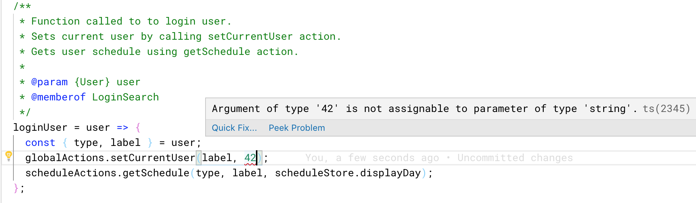

import { Head, Notes } from 'mdx-deck';

import { Split } from 'mdx-deck/layouts';

export { default as theme } from './theme';
import Carbon from './components/Carbon/Carbon.jsx';

import './main.css';

<Head>
  <title>ZHAWo - Platform Independent Timetable App</title>
</Head>

## Platform Independent Timetable App

###### Bachmann Dominik, Visser Julian

<Notes>
  
Intro

Explain what the goal is.

Timetable app:

- for both Android Ios and Desktop
- Fast
- Works offline

</Notes>

---

## Primary functions

<Notes>
  
Timetable

Mensa

Room search

vszhaw news

We had 4 primary functions that we wanted to provide

Timetable, Mensa menus, room search and vszhaw news events

</Notes>

---

## Progressive Web App

<Notes>
  
PWA Advantages vs stuff like native and react-native

- new technology
- goal of project see how practical

Explain caching with service worker:

Tell with urls to cache

- css, font, images
- api requests

First cache ->try and get new data

24h

</Notes>

---

## User stories

**US10**: As a student I want to view my timetable for a day

**US12**: As a student I want to navigate to the current day

**US13**: As a student I want to navigate between days when using the day view

...

<Notes>

Agile approach with sprints of 2 weeks

Split up the primary functions into user stories, f.ex. for timetable ... and
so on

</Notes>

---

## GitHub issues

<Notes>

Used GitHub issues to keep track of user stories, story point estimates as
labels

</Notes>

---

## Sprints

<Notes>
  
For actual sprint planning used GitHub project board

</Notes>

---

## Sprint reviews

<Notes>

Our own review of progress, decisions, and feedback group of classmates and
other students

</Notes>

---

## Architecture

<Notes>

Both frontend and backend in JavaScript,
since most user stories require changes in both front and backend, easier

Layer of abstraction with API adapters

</Notes>

---

## Flux pattern

<Notes>

More detailed look into the frontend React application,

Flux design pattern, unidirectional flow

</Notes>

---

## Flux pattern

---

## View / React component

<Split>

<Carbon lang="JavaScript">
  {`
    handleDateClick = newDate => e => {
      scheduleActions.gotoDay(newDate);
    }; 
      `}
</Carbon>

</Split>

---

## Action dispatcher

<Split>

<Carbon lang="JavaScript">
  {`
  export const gotoDay = targetDate => {
    dispatcher.dispatch({
      type: 'GOTO_DAY',
      payload: targetDate
    });
  };
    `}
</Carbon>

</Split>

---

## Store

<Split>

<Carbon lang="JavaScript">
  {`
  async handleActions(action) {
    switch (action.type) {
      case 'GOTO_DAY':
        const targetDate = action.payload;
        this.displayDay = this.convertSunday(targetDate);
        this.displayWeek = this.createDisplayWeek(this.displayDay);
        this.displayMonth = this.createDisplayMonth(this.displayDay);
        this.emit('schedule_changed');
        break;
    }
  }
  `}
</Carbon>

</Split>

---

## View update

<Split>

<Carbon lang="JavaScript">
  {`
  componentWillMount() {
    scheduleStore.on('schedule_changed', this.refreshSchedule);
  }
  refreshSchedule = () => {
    this.setState({
      displayDay: scheduleStore.displayDay,
      schedule: scheduleStore.schedule
    });
  };
`}

</Carbon>

</Split>

---

## Testing

Run unit tests before pushing code

Track code test coverage with codecov

<Carbon lang="JavaScript">
  {`
    it('should call globalActions.toggleDrawer once ', () => {
      const wrapper = shallow(<AppBarContainer />);
      const instance = wrapper.instance();
      globalActions.toggleDrawer = jest.fn();
      instance.toggleDrawer();
      expect(globalActions.toggleDrawer).toHaveBeenCalled();
    });
  `}
</Carbon>

<Notes>

Extensive unit tests, with git hook to run test suite before every push

</Notes>

---

## JsDoc

<Carbon lang="JavaScript">
  {`
    /**
    * Dispatches action to set a specific user as the current global user
    * requries username and type (student, teacher)
    * @param {string} name
    * @param {string} type
    */
    export const setCurrentUser = (name, type) => {
      dispatcher.dispatch({
        type: 'SET_CURRENT_USER',
        payload: { name, type }
      });
    };
`}
</Carbon>

<Notes>
  
JsDoc allows use Linter in Vscode.

Real time warnings.

Simliar to TypeSript

Helps with lots of functions.

What type now?

</Notes>

---

## Continuous integration

<Notes>
  
Travis CI to keep track of build status

</Notes>

---

## Feedback

<Notes>
  
collected user feedback:

1. small test group people we know
2. candy mensa showed people.

show graphs

things people liked:

- ...

did not like:

- ....

</Notes>

---

## Demo

<Notes>
  
Show all primary functions in presentation and then let expert use app with phone.

</Notes>

---

## Discussion

<Notes>

Happy with results

- have users
- good feedback

vszhaw show next semester

would not recommmed pwa YET

- Buggy
- cahnges with updates
- not equal support
- browser problems

Navive now how will look

PWA have to hope

</Notes>
