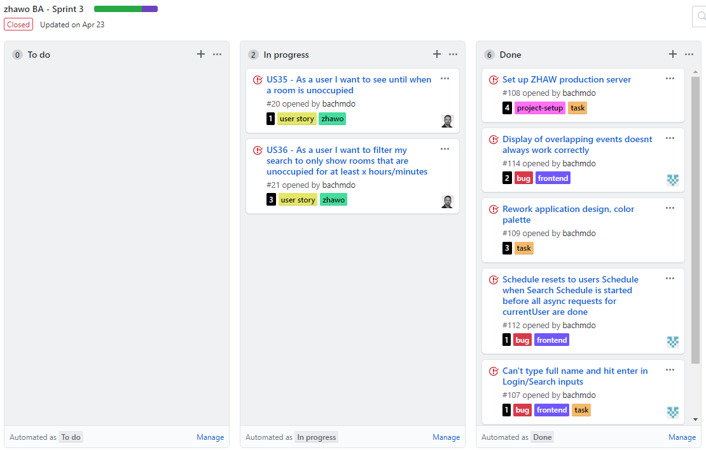
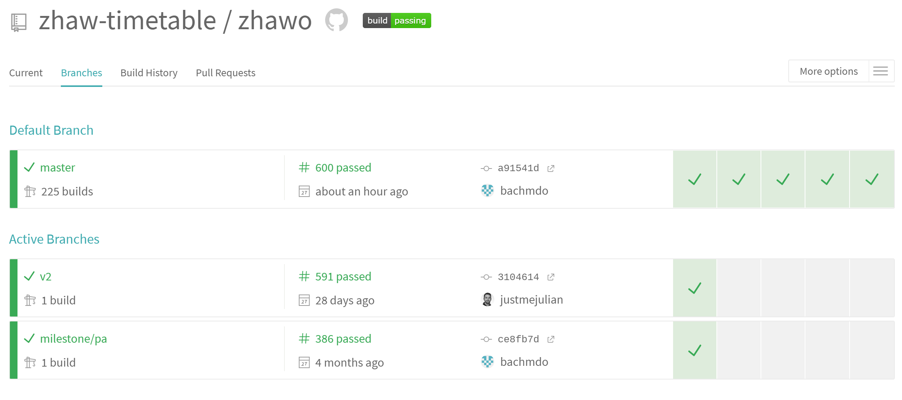
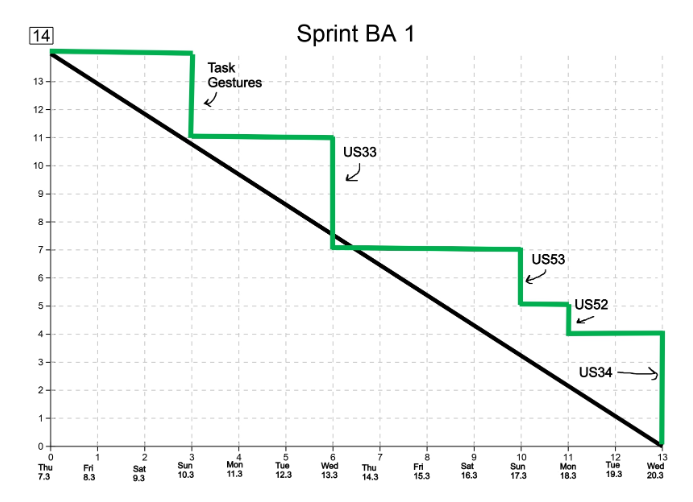
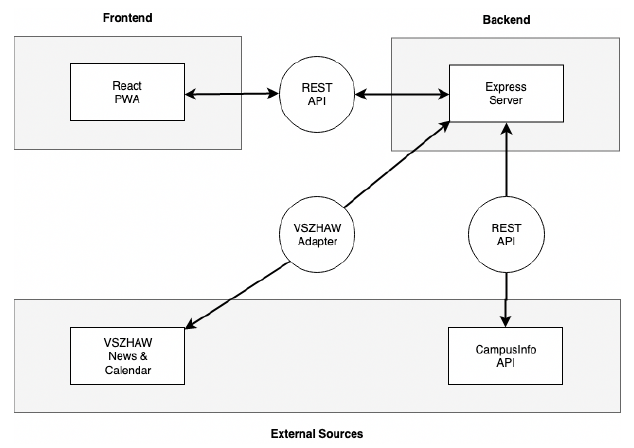
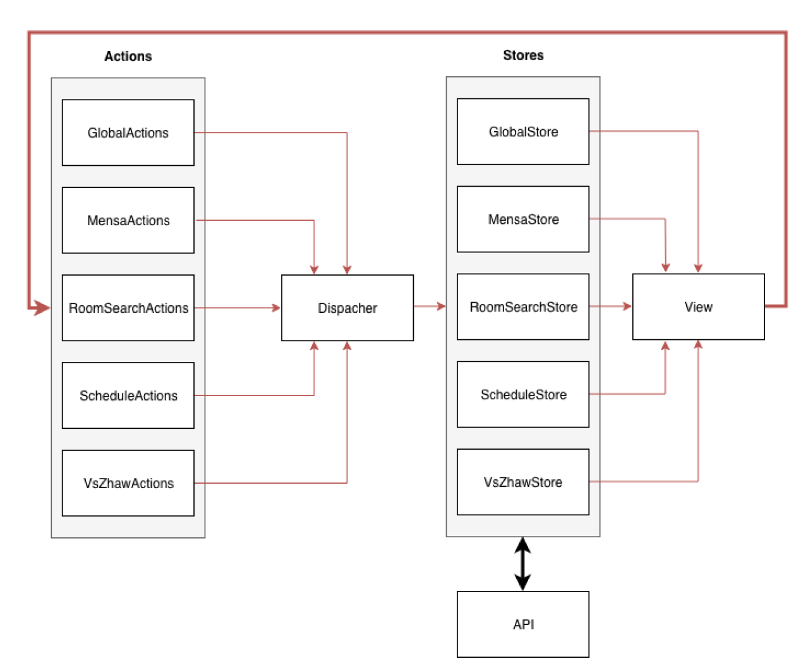
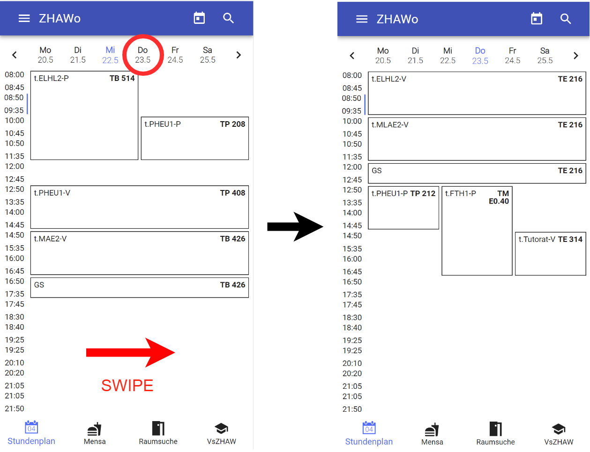

import { Head, Notes } from 'mdx-deck';
export { default as theme } from './theme';
import Carbon from './components/Carbon/Carbon.jsx';

import './main.css';

<Head>
  <title>ZHAWo - Platform Independent Timetable App</title>
</Head>

## Platform Independent Timetable App

###### Bachmann Dominik, Visser Julian

<Notes>
  
Intro

Explain what the goal is.

Timetable app:

- for both Android Ios and Desktop
- Fast
- Works offline

</Notes>

---

## Progressive Web App

<Notes>
  
PWA Advantages vs stuff like native and react-native

- new technology
- goal of project see how practical

Explain caching with service worker:

Tell with urls to cache

- css, font, images
- api requests

First cache ->try and get new data

24h

</Notes>

---

# Development

---

## Primary functions

<Notes>
  
Timetable

Mensa

Room search

vszhaw news

</Notes>

---

## User stories

**US10**: As a student I want to view my timetable for a day

**US12**: As a student I want to navigate to the current day

**US13**: As a student I want to navigate between days when using the day view

...

---

## GitHub issues

---

## Sprints

---

## Testing

Run unit tests before pushing code

Track code test coverage with codecov

---

## Continuous integration

---

## Sprint reviews

---

# Implementation

---

## Architecture

---

## Flux pattern

---

## Code example

<b>US13</b>: As a student I want to navigate between days when using the day view

---

## Code example

---

## View / React component

<Carbon>
  {`
  handleDateClick = newDate => e => {
    scheduleActions.gotoDay(newDate);
  }; 
    `}
</Carbon>

---

## Action dispatcher

<Carbon>
  {`
  export const gotoDay = targetDate => {
    dispatcher.dispatch({
      type: 'GOTO_DAY',
      payload: targetDate
    });
  };
    `}
</Carbon>

---

## Store

<Carbon>
  {`
  async handleActions(action) {
    switch (action.type) {
      case 'GOTO_DAY':
        const targetDate = action.payload;
        this.displayDay = this.convertSunday(targetDate);
        this.displayWeek = this.createDisplayWeek(this.displayDay);
        this.displayMonth = this.createDisplayMonth(this.displayDay);
        this.emit('schedule_changed');
        break;
    }
  }
  `}
</Carbon>

---

## View update

<Carbon>
  {`
  componentWillMount() {
    scheduleStore.on('schedule_changed', this.refreshSchedule);
  }
  refreshSchedule = () => {
    this.setState({
      displayDay: scheduleStore.displayDay,
      schedule: scheduleStore.schedule
    });
  };
`}

</Carbon>

---

## Feedback

<Notes>
  
collected user feedback:

1. small test group people we know
2. candy mensa showed people.

show graphs

things people liked:

- ...

did not like:

- ....

</Notes>

---

## Demo

<Notes>
  
Show all primary functions in presentation and then let expert use app with phone.

</Notes>
