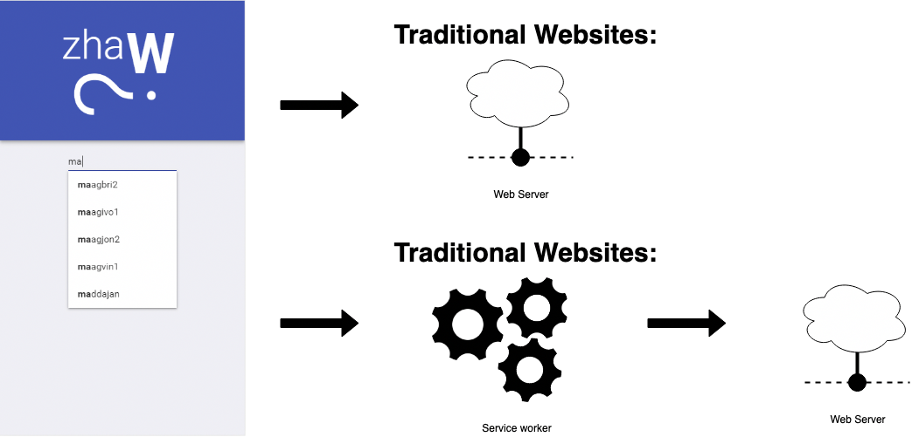
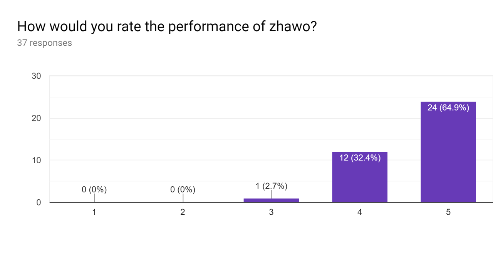
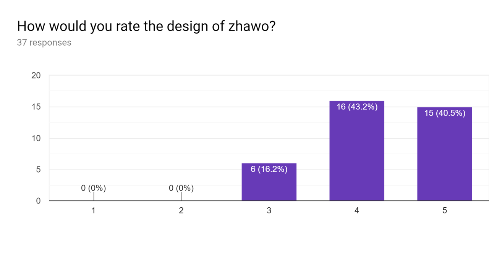

import { Head, Notes } from 'mdx-deck';
export { default as theme } from './theme';
import Carbon from './components/Carbon/Carbon.jsx';

import './main.css';

<Head>
  <title>ZHAWo - Platform Independent Timetable App</title>
</Head>

## Platform Independent Timetable App

###### Bachmann Dominik, Visser Julian

<Notes>
  
Intro

Explain what the goal is with timetable app for both Android Ios and Desktop, fast and working offline.

</Notes>

---

## Progressive Web App

<Notes>
  
Explain Progressive Web Apps Advantages vs stuff like native and react-native, talk about that its a new technology -> also goal of project to see how practical it is. Explain caching with service worker.

</Notes>

---

## Feedback

<Notes>
  
Explain how we collected user feedback and show graphs etc.

</Notes>

---

## Demo

<Notes>
  
Show all primary functions in presentation and then let expert use app with phone.

</Notes>

---

<Carbon lang="javascript">
  {`
    /**
    * Dispatches action to set a specific user as the current global user
    * requries username and type (student, teacher)
    * @param {string} name
    * @param {string} type
    */
    export const setCurrentUser = (name, type) => {
      dispatcher.dispatch({
        type: 'SET_CURRENT_USER',
        payload: { name, type }
      });
    };
`}
</Carbon>

---

# The end
